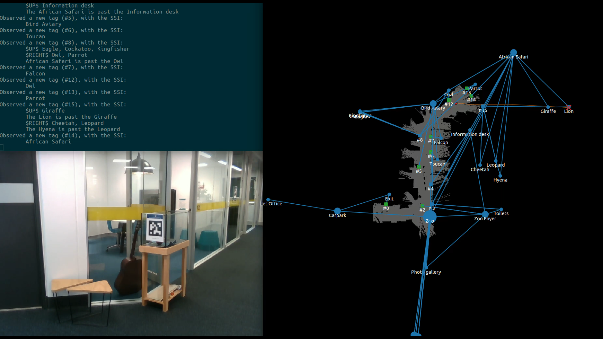
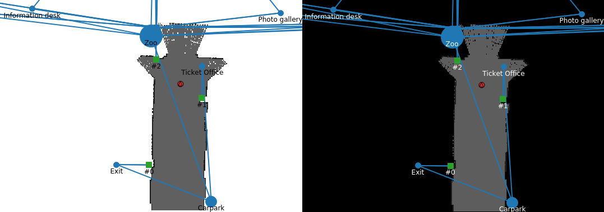

<p align=center><strong>~ Please see the <a href="https://btalb.github.io/abstract_map/">abstract map site</a> for further details about the research publication ~</strong></p>

# The Abstract Map - using symbols to navigate 



This repository provides the implementation of the abstract map used in our [IEEE TCDS journal](https://doi.org/10.1109/TCDS.2020.2993855). The implementation, done in Python, includes the following features:

- a novel dynamics-based malleable spatial model for imagining unseen spaces from symbols (which includes simulated springs, friction, repulsive forces, & collision models)
- a visualiser & text-based commentator for introspection of your navigation system (both shown in videos on the [repository website](https://btalb.github.io/abstract_map/))
- easy ROS bindings for getting up & running in simulation or on a real robot
- tag readers & interpreters for extracting symbolic spatial information from [AprilTags](http://wiki.ros.org/apriltag_ros) 
- configuration files for the zoo experiments performed on GP-S11 of QUT's Gardens Point campus (see [the paper](https://doi.org/10.1109/TCDS.2020.2993855) for further details)
- serialisation methods for passing an entire abstract map state between machines, or saving to file

Please see our other related repositories for further resources, and related parts of the abstract map studies:
- **[abstract_map_simulator](https://github.com/btalb/abstract_map_simulator):** all of the resources needed to run a full 2D simulation of the zoo experiments performed on GP-S11 of our Gardens Point campus at QUT
- **[abstract_map_app](https://github.com/btalb/abstract_map_app):** mobile Android application used by human participants to complete navigation tasks as part of the zoo experiments (the app used the on-board camera to scan tags & present the mapped symbolic spatial information in real time) 

## Getting up & running with the abstract map

*Note: if you wish to run this in simulation (significantly easier than on a real robot platform), you will also need the [abstract_map_simulator](https://github.com/btalb/abstract_map_simulator) package*

### Setting up your environment

Clone the repo & install all Python dependencies:
```
git clone https://github.com/btalb/abstract_map
pip install -r abstract_map/requirements.txt
```

Add the new package to your ROS workspace at `<ROS_WS>/` by linking in the cloned repository:
```
ln -s <LOCATION_REPO_WAS_CLONED_ABOVE> <ROS_WS>/src/
```

Install all of the listed ROS dependencies, and build the package:
```
cd <ROS_WS>/src/abstract_map
rosdep install .
cd <ROS_WS>
catkin_make
```

### Running the Zoo experiments

Start the experiment (this will try & launch the 2D simulation back-end by default, so make sure you have that installed if you are using it):
```
roslaunch abstract_map experiment.launch
```

In another terminal, start the hierarchy publisher to give the abstract map the contextual symbolic spatial information to begin with:
```
rosrun abstract_map hierarchy_publisher
```
This will use the hierarchy available in `./experiments/zoo_hierarchy.xml` by default. Feel free to make your own if you would like to do different experiments.

Start the visualiser in preparation of beginning the experiment (pick either light or dark mode with one of the two commands):
```
rosrun abstract_map visualiser
```
```
rosrun abstract_map visualiser --dark
```


Finally, start the abstract map with a goal, and watch it attempt to complete the navigation task:
```
roslaunch abstract_map abstract_map.launch goal:=Lion
```
If you want to manually drive the robot around and observe how the abstract map evolves over time, you can run the above command without a goal to start in "observe mode".

## Acknowledgements & Citing our work

This work was supported by the Australian Research Council's Discovery Projects Funding Scheme under Project DP140103216. The authors are with the [QUT Centre for Robotics](https://research.qut.edu.au/qcr/).

If you use this software in your research, or for comparisons, please kindly cite our work:

```
@ARTICLE{9091567,  
    author={B. {Talbot} and F. {Dayoub} and P. {Corke} and G. {Wyeth}},  
    journal={IEEE Transactions on Cognitive and Developmental Systems},   
    title={Robot Navigation in Unseen Spaces using an Abstract Map},   
    year={2020},  
    volume={},  
    number={},  
    pages={1-1},
    keywords={Navigation;Robot sensing systems;Measurement;Linguistics;Visualization;symbol grounding;symbolic spatial information;abstract map;navigation;cognitive robotics;intelligent robots.},
    doi={10.1109/TCDS.2020.2993855},
    ISSN={2379-8939},
    month={},}
}
```
